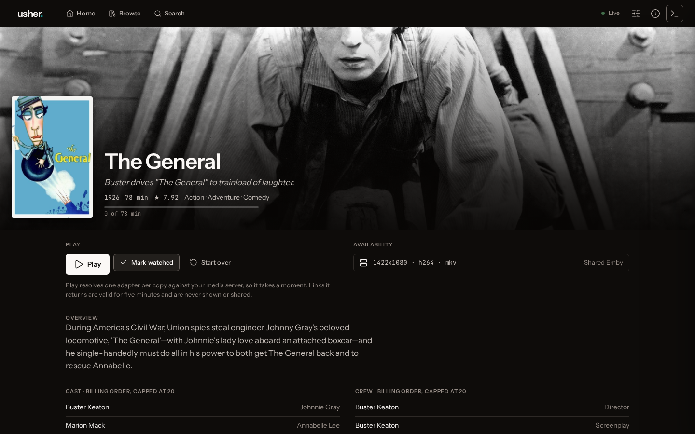

# Usher

**A self-hosted media catalog that sits in front of your media server.**

[](https://github.com/anirudhlath/usher/actions/workflows/ci.yml)
[](https://github.com/anirudhlath/usher/releases)
[](LICENSE)




Usher keeps its own database of film and television: 1.28 million titles from
IMDb. The titles Wikidata links to TMDb can also be enriched from TMDb with
artwork, overviews and cast. Usher treats your media server as a *source* that
answers one question, "where can I play this?". On top of the catalog it serves
an HTTP API and a web console with browsing, search, similar titles, a personal
home screen and playback. Emby is the first source.

## Features

- **Your own catalog.** Every title has an identity that belongs to Usher, not
  to a media server. Your library is matched against the catalog, so you can
  browse and search titles you don't own too.
- **Emby as a source.** Full and incremental library walks, live updates over
  Emby's websocket, and watch state synced in both directions.
- **Search.** Full-text search and typo-tolerant type-ahead. Semantic search is
  optional and runs against any OpenAI-compatible embeddings endpoint.
- **A home screen.** Continue Watching, Next Up, Because You Watched, Recently
  Added, and rows built from genres, people, franchises, the season and titles
  worth rediscovering. A language model can curate extra rows.
- **Playback.** A play request returns a short-lived ticket that redirects to
  the source's stream.
- **Web console.** A viewer for browsing and playing, and an operator view for
  imports, sync, the review queue and metrics.
- **Operations.** Backup and restore, secret rotation, a scheduler,
  OpenTelemetry export, and Grafana dashboards and alerts.

## Quickstart

You need Docker Compose v2.24 or later, an Emby server, a free
[TMDb API key](https://www.themoviedb.org/settings/api), and about 10 GB of
disk for the catalog to start with.

> [!WARNING]
> No route checks a credential, so keep Usher on your LAN. See [Security](#security).

**1. Configure.**

```sh
git clone https://github.com/anirudhlath/usher.git
cd usher
cp .env.example .env
```

In `.env`, fill in the two lines that are already there:

- `USHER_SECRET_KEY=`: paste the output of `openssl rand -hex 32`.
- `USHER_TMDB_API_KEY=`: paste your TMDb key. Without it, Usher still starts,
  logs one warning, and enriches nothing.

Compose reads `.env` only when it creates the container, so set both before step
2. If you change `.env` later, run `docker compose up -d` again. Already running
Usher on this host? [Give this stack its own name first](docs/guide/configuration.md#a-second-stack-on-one-host).

**2. Start.**

```sh
mkdir -p data/images data/bulk && sudo chown 1000:1000 data/images data/bulk
docker compose up -d --build --wait
curl -s http://localhost:8100/health/ready
```

The container runs as uid 1000, and Docker would create these directories as
root. Without the `chown`, the dataset downloads in step 3 fail, and so does
every image the console hasn't cached yet. `--wait` returns once the server
reports healthy.

**3. Load the catalog.** This takes 10–25 minutes, most of it the Wikidata
crosswalk.

```sh
docker compose exec usher usher bootstrap --phase imdb
docker compose exec usher usher bootstrap --phase tmdb-ids
docker compose exec usher usher bootstrap --phase crosswalk
docker compose exec usher usher bootstrap-status
```

All three phases are needed. IMDb supplies the titles, and the other two give
them the TMDb ids that enrichment needs. Every row of `bootstrap-status` should
read `completed`. A phase that fails exits 1 and prints the command that resumes
it. Finish any failed phase before step 4. Otherwise your titles' enrichment jobs
fail with `title carries no tmdb id to enrich from` and are never retried
([#87](https://github.com/anirudhlath/usher/issues/87)).

**4. Connect Emby and walk your library.**

```sh
curl -sf -X POST http://localhost:8100/admin/sources \
  -H 'content-type: application/json' \
  -d '{"kind":"emby","name":"Living Room","base_url":"https://emby.example.com","username":"YOUR_USER","password":"YOUR_PASSWORD"}'

docker compose exec usher usher sync --source "Living Room"
```

The credentials are encrypted at rest with `USHER_SECRET_KEY`. The first walk
reads every item, as fast as your media server answers, so a large library can
take hours. The command prints nothing while it runs, so watch it from another
terminal with `docker compose exec usher usher sync-status`. If it's
interrupted, run it again. The item walk starts over from the beginning but
duplicates nothing, and the watch-state walk resumes from its checkpoint.

**5. Open the console** at <http://localhost:8100/console>. The API's
interactive reference is at <http://localhost:8100/docs>.

The server enriches your titles from TMDb in the background, one rate-limited
request per title, so artwork and overviews keep filling in for hours after the
walk.

- **Recently Added** appears first, if anything was added to your media server
  in the last 30 days.
- **Continue Watching**, **Next Up** and **Because You Watched** follow once the
  watch-state walk has run. It starts after the item walk.
- An empty home screen early on is not an error. It means no row has anything to
  show yet.

## Documentation

- **[Configuration](docs/guide/configuration.md):** the settings that matter,
  running [two stacks on one host](docs/guide/configuration.md#a-second-stack-on-one-host),
  and the optional features:
  [semantic search and "more like this"](docs/guide/configuration.md#semantic-search),
  [LLM-curated rows](docs/guide/configuration.md#llm-curated-rows) and
  [telemetry](docs/guide/configuration.md#telemetry). `.env.example` documents
  every setting.
- **[Command line](docs/guide/command-line.md):** every `usher` command, grouped
  by task, including the
  [optional catalog phases](docs/guide/command-line.md#loading-the-catalog) for
  cast and crew names, alternate titles and the MovieLens tag genome.
- **[Building a client](docs/guide/clients.md):** the HTTP API, errors, paging,
  playback tickets, and the attribution you must display.
- **[Runbooks](docs/runbooks/README.md):** restore, disaster recovery, upgrades
  and secret rotation.
- **[Console development](web/README.md):** working on the web client in `web/`.
- **[Design (PRD)](docs/prd/README.md):** what Usher does, one subsystem per
  document.
- **[Changelog](CHANGELOG.md):** what each release changed.

## Security

**No route checks a credential, and twelve of them are `/admin`.** Anyone who
can reach the port can register sources, start hours-long imports and spend
money on LLM calls. Usher is built for a home network, and auth is tracked in
[#18](https://github.com/anirudhlath/usher/issues/18).

By default compose publishes Usher on every interface of the host, and ports
Docker publishes bypass host firewalls such as ufw. To publish it on one
address, set that address in `.env`: `USHER_COMPOSE_HOST_PORT=192.168.1.10:8100`
for your LAN address, or `127.0.0.1:8100` for the host alone. To reach it from
anywhere else, put it behind a reverse proxy with authentication, a VPN or an
SSH tunnel.

Report vulnerabilities as described in [SECURITY.md](SECURITY.md).

## Backup

Most of the database can be rebuilt from the public datasets. `usher backup`
writes only the part that can't, as one small file:

```sh
docker compose exec usher usher backup --output /data/bulk/usher-backup.jsonl.gz
```

The file lands in `data/bulk/` on the host. **Copy it off this host, together
with `USHER_SECRET_KEY`.** Credentials are stored encrypted, and the file
carries no key.

The file holds your household (`users`, `watch_states`,
`row_provider_settings`), your sources (`sources`, `source_credentials`), the
search log (`search_queries`), the LLM spend ledger (`llm_calls`), and which
catalog title each of your library's items is matched to, including any matches
you made by hand.

A backup can't be restored into an empty database, so recovery rebuilds the
catalog first. The restore itself takes seconds, the rebuild that follows takes
hours, and Usher keeps serving in between. The
[restore runbook](docs/runbooks/restore.md) has the full sequence.

## Data sources and attribution

Usher ships importers, never data. Each deployment downloads its own copies of
[IMDb's datasets](https://developer.imdb.com/non-commercial-datasets/),
[TMDb](https://www.themoviedb.org), [Wikidata](https://www.wikidata.org) and
[MovieLens](https://grouplens.org/datasets/movielens/), and uses its own API key.

- Information courtesy of IMDb (https://www.imdb.com). Used with permission.
- This product uses the TMDB API but is not endorsed or certified by TMDB. Data
  from The Movie Database (https://www.themoviedb.org).
- ID crosswalk from Wikidata (https://www.wikidata.org), available under CC0 1.0.
- F. Maxwell Harper and Joseph A. Konstan. 2015. The MovieLens Datasets: History
  and Context. ACM Transactions on Interactive Intelligent Systems (TiiS) 5, 4:
  19:1-19:19. https://doi.org/10.1145/2827872

A client must display these strings, which `GET /meta/attribution` serves. It
must also display TMDb's logo, which Usher cannot ship for you. See
[Building a client](docs/guide/clients.md#attribution).

## Versioning

Releases are `0.x`, and the wire contract is not frozen yet: there is no
authentication, and only one source adapter has ever exercised the source
interface. **Pin the minor version.**

Images are published to `ghcr.io/anirudhlath/usher` for `linux/amd64`, tagged
without the `v`: tag `v0.1.0` publishes `:0.1.0`, `:0.1` and `:latest`. The
quickstart's `compose.yml` builds from your checkout and doesn't use them.

## Contributing

Issues and pull requests are welcome. Usher has a single maintainer.
[CONTRIBUTING.md](CONTRIBUTING.md) covers the test suite and the gate a change
has to pass.

## License

[MIT](LICENSE)
